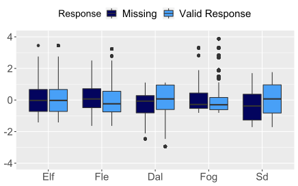

```{r, include=FALSE}
knitr::opts_chunk$set(echo = FALSE,
                      warning = FALSE,
                      tidy = FALSE,
                      message = FALSE,
                      fig.align = 'center',
                      out.width = "100%")
options(knitr.table.format = "html") 

knitr::write_bib(c('posterdown', 'rmarkdown','pagedown'), 'packages.bib')

```


```{css, echo=FALSE}
.main_pic {
  border-radius: 50%;
  width: 90%;
  vertical-align: top;
}

.main-img-right {
  width: 100%;
}

.new-img-right {
  position: absolute;
  bottom: 100px;
  right: 150px;
  width: 1500px;           /* Play with width and height specifications if image stretches*/
  height: 800px;
}

.new-img-left {
  position: absolute;
  bottom: 100px;
  left: 100px;
  width: 1200px;           /* Play with width and height specifications if image stretches*/
  height: 1100px;
}

.logoleft_name {
  position: absolute;
  bottom: 1000px;
  left: 100px;
  width: 1200px;           /* Play with width and height specifications if image stretches*/
  height: 1100px;
}

.new-img-top {
  position: absolute;
  top: 100px;
  left: 100px;
  width: 1200px;           
  height: 100px;
}

```

```{r data, echo=FALSE, message=FALSE, warning=FALSE, include=FALSE}

## Trying to replicate "grabbing data.sps" file

library(dplyr)

self1 <- read.csv("Observer-Rated Personality_ Self1 (Fall 2019) - Copy - Copy_December 3, 2019_13.53.csv") 

self1 <- self1 %>% 
  rename(
    item1=QID5362,
    item2=QID5363,
    item3=QID5364,
    item4=QID5365,
    item5=QID5366,
    item6=QID5367,
    item7=QID5368,
    item8=QID5369,
    item9=QID5370,
    item10=QID5371,
    item11=QID5372,
    item12=QID5373,
    item13=QID5374,
    item14=QID5375,
    item15=QID5376,
    item16=QID5377,
    item17=QID5378,
    item18=QID5379,
    item19=QID5380,
    item20=QID5381,
    item21=QID5382,
    item22=QID5383,
    item23=QID5384,
    item24=QID5385,
    item25=QID5386,
    item26=QID5387,
    item27=QID5388,
    item28=QID5389,
    item29=QID5390,
    item30=QID5391,
    item31=QID5392,
    item32=QID5393,
    item33=QID5394,
    item34=QID5395,
    item35=QID5396,
    item36=QID5397,
    item37=QID5398,
    item38=QID5399,
    item39=QID5400,
    item40=QID5401,
    item41=QID5402,
    item42=QID5403,
    item43=QID5404,
    item44=QID5405,
    item45=QID5406,
    item46=QID5407,
    item47=QID5408,
    item48=QID5409,
    item49=QID5410,
    item50=QID5411,
    item51=QID5412,
    item52=QID5413,
    item53=QID5414,
    item54=QID5415,
    item55=QID5416,
    item56=QID5417,
    item57=QID5418,
    item58=QID5419,
    item59=QID5420,
    item60=QID5421,
    item61=QID5422,
    item62=QID5423,
    item63=QID5424,
    item64=QID5425,
    item65=QID5426,
    item66=QID5427,
    item67=QID5428,
    item68=QID5429,
    item69=QID5430,
    item70=QID5431,
    item71=QID5432,
    item72=QID5433,
    item73=QID5434,
    item74=QID5435,
    item75=QID5436,
    item76=QID5437,
    item77=QID5438,
    item78=QID5439,
    item79=QID5440,
    item80=QID5441,
    first_rm=Q2365,
    rated=Q2364
  )

self1$form <- 1

self_1 <- self1[-c(1:2),c(18:97,103,101,102)]  ## Trying to replicate file in "grabbing data.sps"


self2 <- read.csv("Observer-Rated Personality_ Self2 (Fall 2019) - Copy - Copy_December 8, 2019_09.37.csv") 

self2 <- self2 %>% 
  rename(
item1	= QID5442,
item2	= QID5443,
item3	= QID5444,
item4	= QID5445,
item5	= QID5446,
item6	= QID5447,
item7	= QID5448,
item8	= QID5449,
item9	= QID5450,
item10	= QID5451,
item11	= QID5452,
item12	= QID5453,
item13	= QID5454,
item14	= QID5455,
item15	= QID5456,
item16	= QID5457,
item17	= QID5458,
item18	= QID5459,
item19	= QID5460,
item20	= QID5461,
item21	= QID5462,
item22	= QID5463,
item23	= QID5464,
item24	= QID5465,
item25	= QID5466,
item26	= QID5467,
item27	= QID5468,
item28	= QID5469,
item29	= QID5470,
item30	= QID5471,
item31	= QID5472,
item32	= QID5473,
item33	= QID5474,
item34	= QID5475,
item35	= QID5476,
item36	= QID5477,
item37	= QID5478,
item38	= QID5479,
item39	= QID5480,
item40	= QID5481,
item41	= QID5482,
item42	= QID5483,
item43	= QID5484,
item44	= QID5485,
item45	= QID5486,
item46	= QID5487,
item47	= QID5488,
item48	= QID5489,
item49	= QID5490,
item50	= QID5491,
item51	= QID5492,
item52	= QID5493,
item53	= QID5494,
item54	= QID5495,
item55	= QID5496,
item56	= QID5497,
item57	= QID5498,
item58	= QID5499,
item59	= QID5500,
item60	= QID5501,
item61	= QID5502,
item62	= QID5503,
item63	= QID5504,
item64	= QID5505,
item65	= QID5506,
item66	= QID5507,
item67	= QID5508,
item68	= QID5509,
item69	= QID5510,
item70	= QID5511,
item71	= QID5512,
item72	= QID5513,
item73	= QID5514,
item74	= QID5515,
item75	= QID5516,
item76	= QID5517,
item77	= QID5518,
item78	= QID5519,
item79	= QID5520,
item80	= QID5521,
first_rm = Q2365,
rated = Q2364
)

self2$form <- 2

# temp <- describe(self2)
# write.csv(temp,"C:\\temp\\temp.csv")

self_2 <- self2[-c(1:2),c(18:97,100,98,99)] 


self3 <- read.csv("Observer-Rated Personality_ Self3 (Fall 2019) - Copy - Copy_December 8, 2019_09.45.csv") 

self3 <- self3 %>% 
  rename(
    item1=	QID5522,
    item2=	QID5523,
    item3=	QID5524,
    item4=	QID5525,
    item5=	QID5526,
    item6=	QID5527,
    item7=	QID5528,
    item8=	QID5529,
    item9=	QID5530,
    item10=	QID5531,
    item11=	QID5532,
    item12=	QID5533,
    item13=	QID5534,
    item14=	QID5535,
    item15=	QID5536,
    item16=	QID5537,
    item17=	QID5538,
    item18=	QID5539,
    item19=	QID5540,
    item20=	QID5541,
    item21=	QID5542,
    item22=	QID5543,
    item23=	QID5544,
    item24=	QID5545,
    item25=	QID5546,
    item26=	QID5547,
    item27=	QID5548,
    item28=	QID5549,
    item29=	QID5550,
    item30=	QID5551,
    item31=	QID5552,
    item32=	QID5553,
    item33=	QID5554,
    item34=	QID5555,
    item35=	QID5556,
    item36=	QID5557,
    item37=	QID5558,
    item38=	QID5559,
    item39=	QID5560,
    item40=	QID5561,
    item41=	QID5562,
    item42=	QID5563,
    item43=	QID5564,
    item44=	QID5565,
    item45=	QID5566,
    item46=	QID5567,
    item47=	QID5568,
    item48=	QID5569,
    item49=	QID5570,
    item50=	QID5571,
    item51=	QID5572,
    item52=	QID5573,
    item53=	QID5574,
    item54=	QID5575,
    item55=	QID5576,
    item56=	QID5577,
    item57=	QID5578,
    item58=	QID5579,
    item59=	QID5580,
    item60=	QID5581,
    item61=	QID5582,
    item62=	QID5583,
    item63=	QID5584,
    item64=	QID5585,
    item65=	QID5586,
    item66=	QID5587,
    item67=	QID5588,
    item68=	QID5589,
    item69=	QID5590,
    item70=	QID5591,
    item71=	QID5592,
    item72=	QID5593,
    item73=	QID5594,
    item74=	QID5595,
    item75=	QID5596,
    item76=	QID5597,
    item77=	QID5598,
    item78=	QID5599,
    item79=	QID5600,
    item80=	QID5601,
    first_rm = Q2365,
    rated=	Q2364
  )

self3$form <- 3

# temp <- describe(self3)
# write.csv(temp,"C:\\temp\\temp.csv")

self_3 <- self3[-c(1:2),c(18:97,100,98,99)] 


self4 <- read.csv("Observer-Rated Personality_ Self4 (Fall 2019) - Copy - Copy_December 8, 2019_09.54.csv") 

self4 <- self4 %>% 
  rename(
    item1=	QID5602,
    item2=	QID5603,
    item3=	QID5604,
    item4=	QID5605,
    item5=	QID5606,
    item6=	QID5607,
    item7=	QID5608,
    item8=	QID5609,
    item9=	QID5610,
    item10=	QID5611,
    item11=	QID5612,
    item12=	QID5613,
    item13=	QID5614,
    item14=	QID5615,
    item15=	QID5616,
    item16=	QID5617,
    item17=	QID5618,
    item18=	QID5619,
    item19=	QID5620,
    item20=	QID5621,
    item21=	QID5622,
    item22=	QID5623,
    item23=	QID5624,
    item24=	QID5625,
    item25=	QID5626,
    item26=	QID5627,
    item27=	QID5628,
    item28=	QID5629,
    item29=	QID5630,
    item30=	QID5631,
    item31=	QID5632,
    item32=	QID5633,
    item33=	QID5634,
    item34=	QID5635,
    item35=	QID5636,
    item36=	QID5637,
    item37=	QID5638,
    item38=	QID5639,
    item39=	QID5640,
    item40=	QID5641,
    item41=	QID5642,
    item42=	QID5643,
    item43=	QID5644,
    item44=	QID5645,
    item45=	QID5646,
    item46=	QID5647,
    item47=	QID5648,
    item48=	QID5649,
    item49=	QID5650,
    item50=	QID5651,
    item51=	QID5652,
    item52=	QID5653,
    item53=	QID5654,
    item54=	QID5655,
    item55=	QID5656,
    item56=	QID5657,
    item57=	QID5658,
    item58=	QID5659,
    item59=	QID5660,
    item60=	QID5661,
    item61=	QID5662,
    item62=	QID5663,
    item63=	QID5664,
    item64=	QID5665,
    item65=	QID5666,
    item66=	QID5667,
    item67=	QID5668,
    item68=	QID5669,
    item69=	QID5670,
    item70=	QID5671,
    item71=	QID5672,
    item72=	QID5673,
    item73=	QID5674,
    item74=	QID5675,
    item75=	QID5676,
    item76=	QID5677,
    item77=	QID5678,
    item78=	QID5679,
    item79=	QID5680,
    item80=	QID5681,
    first_rm=	Q2365,
    rated=	Q2364
  )

self4$form <- 4

# temp <- describe(self4)
# write.csv(temp,"C:\\temp\\temp.csv")

self_4 <- self4[-c(1:2),c(18:97,100,98,99)] 

self_together <- rbind(self_1,self_2,self_3,self_4)

###############################################################################################
###############################################################################################
###############################################################################################
###############################################################################################
###############################################################################################
###############################################################################################
###############################################################################################
###############################################################################################
###############################################################################################
###############################################################################################

once1 <- read.csv("Observer-Rated+Personality_+Once+Removed+1+(Fall+2019)+-+Copy+-+Copy_December+13,+2019_10.30.csv") 

once1 <- once1 %>% 
  rename(
    i1=QID5362,
    i2=QID5363,
    i3=QID5364,
    i4=QID5365,
    i5=QID5366,
    i6=QID5367,
    i7=QID5368,
    i8=QID5369,
    i9=QID5370,
    i10=QID5371,
    i11=QID5372,
    i12=QID5373,
    i13=QID5374,
    i14=QID5375,
    i15=QID5376,
    i16=QID5377,
    i17=QID5378,
    i18=QID5379,
    i19=QID5380,
    i20=QID5381,
    i21=QID5382,
    i22=QID5383,
    i23=QID5384,
    i24=QID5385,
    i25=QID5386,
    i26=QID5387,
    i27=QID5388,
    i28=QID5389,
    i29=QID5390,
    i30=QID5391,
    i31=QID5392,
    i32=QID5393,
    i33=QID5394,
    i34=QID5395,
    i35=QID5396,
    i36=QID5397,
    i37=QID5398,
    i38=QID5399,
    i39=QID5400,
    i40=QID5401,
    i41=QID5402,
    i42=QID5403,
    i43=QID5404,
    i44=QID5405,
    i45=QID5406,
    i46=QID5407,
    i47=QID5408,
    i48=QID5409,
    i49=QID5410,
    i50=QID5411,
    i51=QID5412,
    i52=QID5413,
    i53=QID5414,
    i54=QID5415,
    i55=QID5416,
    i56=QID5417,
    i57=QID5418,
    i58=QID5419,
    i59=QID5420,
    i60=QID5421,
    i61=QID5422,
    i62=QID5423,
    i63=QID5424,
    i64=QID5425,
    i65=QID5426,
    i66=QID5427,
    i67=QID5428,
    i68=QID5429,
    i69=QID5430,
    i70=QID5431,
    i71=QID5432,
    i72=QID5433,
    i73=QID5434,
    i74=QID5435,
    i75=QID5436,
    i76=QID5437,
    i77=QID5438,
    i78=QID5439,
    i79=QID5440,
    i80=QID5441,
    recommend2 = Q85,
    twice2     = Q2365,
    confirm2   = Q2364,
    know2      = Q88,
    freq2      = Q89
  )

once1$form2 <- 1
# temp <- describe(once1)
# write.csv(temp,"C:\\temp\\temp.csv")

##    /keep=i1 to i80 form2 recommend2 twice2 confirm2 know2 freq2.
once_1 <- once1[-c(1:2),c(19:98,105,18,99:102)]  ## Trying to replicate file in "grabbing data.sps"


once2 <- read.csv("Observer-Rated+Personality_+Once+Removed+2+(Fall+2019)+-+Copy+-+Copy_December+13,+2019_10.30.csv") 

once2 <- once2 %>% 
  rename(
    i1=	QID5443,
    i2=	QID5444,
    i3=	QID5445,
    i4=	QID5446,
    i5=	QID5447,
    i6=	QID5448,
    i7=	QID5449,
    i8=	QID5450,
    i9=	QID5451,
    i10=	QID5452,
    i11=	QID5453,
    i12=	QID5454,
    i13=	QID5455,
    i14=	QID5456,
    i15=	QID5457,
    i16=	QID5458,
    i17=	QID5459,
    i18=	QID5460,
    i19=	QID5461,
    i20=	QID5462,
    i21=	QID5463,
    i22=	QID5464,
    i23=	QID5465,
    i24=	QID5466,
    i25=	QID5467,
    i26=	QID5468,
    i27=	QID5469,
    i28=	QID5470,
    i29=	QID5471,
    i30=	QID5472,
    i31=	QID5473,
    i32=	QID5474,
    i33=	QID5475,
    i34=	QID5476,
    i35=	QID5477,
    i36=	QID5478,
    i37=	QID5479,
    i38=	QID5480,
    i39=	QID5481,
    i40=	QID5482,
    i41=	QID5483,
    i42=	QID5484,
    i43=	QID5485,
    i44=	QID5486,
    i45=	QID5487,
    i46=	QID5488,
    i47=	QID5489,
    i48=	QID5490,
    i49=	QID5491,
    i50=	QID5492,
    i51=	QID5493,
    i52=	QID5494,
    i53=	QID5495,
    i54=	QID5496,
    i55=	QID5497,
    i56=	QID5498,
    i57=	QID5499,
    i58=	QID5500,
    i59=	QID5501,
    i60=	QID5502,
    i61=	QID5503,
    i62=	QID5504,
    i63=	QID5505,
    i64=	QID5506,
    i65=	QID5507,
    i66=	QID5508,
    i67=	QID5509,
    i68=	QID5510,
    i69=	QID5511,
    i70=	QID5512,
    i71=	QID5513,
    i72=	QID5514,
    i73=	QID5515,
    i74=	QID5516,
    i75=	QID5517,
    i76=	QID5518,
    i77=	QID5519,
    i78=	QID5520,
    i79=	QID5521,
    i80=	QID5522,
    recommend2=	Q85,
    twice2=	Q2365,
    confirm2=	Q2364,
    know2=	Q89,
    freq2=	Q91
  )

once2$form2 <- 2

# temp <- describe(once2)
# write.csv(temp,"C:\\temp\\temp.csv")

once_2 <- once2[-c(1:2),c(19:98,105,18,99:102)] 


once3 <- read.csv("Observer-Rated+Personality_+Once+Removed+3+(Fall+2019)+-+Copy+-+Copy_December+13,+2019_10.29.csv") 

once3 <- once3 %>% 
  rename(
    i1=	QID5523,
    i2=	QID5524,
    i3=	QID5525,
    i4=	QID5526,
    i5=	QID5527,
    i6=	QID5528,
    i7=	QID5529,
    i8=	QID5530,
    i9=	QID5531,
    i10=	QID5532,
    i11=	QID5533,
    i12=	QID5534,
    i13=	QID5535,
    i14=	QID5536,
    i15=	QID5537,
    i16=	QID5538,
    i17=	QID5539,
    i18=	QID5540,
    i19=	QID5541,
    i20=	QID5542,
    i21=	QID5543,
    i22=	QID5544,
    i23=	QID5545,
    i24=	QID5546,
    i25=	QID5547,
    i26=	QID5548,
    i27=	QID5549,
    i28=	QID5550,
    i29=	QID5551,
    i30=	QID5552,
    i31=	QID5553,
    i32=	QID5554,
    i33=	QID5555,
    i34=	QID5556,
    i35=	QID5557,
    i36=	QID5558,
    i37=	QID5559,
    i38=	QID5560,
    i39=	QID5561,
    i40=	QID5562,
    i41=	QID5563,
    i42=	QID5564,
    i43=	QID5565,
    i44=	QID5566,
    i45=	QID5567,
    i46=	QID5568,
    i47=	QID5569,
    i48=	QID5570,
    i49=	QID5571,
    i50=	QID5572,
    i51=	QID5573,
    i52=	QID5574,
    i53=	QID5575,
    i54=	QID5576,
    i55=	QID5577,
    i56=	QID5578,
    i57=	QID5579,
    i58=	QID5580,
    i59=	QID5581,
    i60=	QID5582,
    i61=	QID5583,
    i62=	QID5584,
    i63=	QID5585,
    i64=	QID5586,
    i65=	QID5587,
    i66=	QID5588,
    i67=	QID5589,
    i68=	QID5590,
    i69=	QID5591,
    i70=	QID5592,
    i71=	QID5593,
    i72=	QID5594,
    i73=	QID5595,
    i74=	QID5596,
    i75=	QID5597,
    i76=	QID5598,
    i77=	QID5599,
    i78=	QID5600,
    i79=	QID5601,
    i80=	QID5602,
    recommend2=	Q85,
    twice2=	Q2365,
    confirm2=	Q2364,
    know2=	Q89,
    freq2=	Q91
  )

once3$form2 <- 3

# temp <- describe(once3)
# write.csv(temp,"C:\\temp\\temp.csv")

once_3 <- once3[-c(1:2),c(19:98,105,18,99:102)]  


once4 <- read.csv("Observer-Rated Personality_ Once Removed 4 (Fall 2019) - Copy - Copy_December 8, 2019_10.36.csv") 

once4 <- once4 %>% 
  rename(
    i1=	QID5603,
    i2=	QID5604,
    i3=	QID5605,
    i4=	QID5606,
    i5=	QID5607,
    i6=	QID5608,
    i7=	QID5609,
    i8=	QID5610,
    i9=	QID5611,
    i10=	QID5612,
    i11=	QID5613,
    i12=	QID5614,
    i13=	QID5615,
    i14=	QID5616,
    i15=	QID5617,
    i16=	QID5618,
    i17=	QID5619,
    i18=	QID5620,
    i19=	QID5621,
    i20=	QID5622,
    i21=	QID5623,
    i22=	QID5624,
    i23=	QID5625,
    i24=	QID5626,
    i25=	QID5627,
    i26=	QID5628,
    i27=	QID5629,
    i28=	QID5630,
    i29=	QID5631,
    i30=	QID5632,
    i31=	QID5633,
    i32=	QID5634,
    i33=	QID5635,
    i34=	QID5636,
    i35=	QID5637,
    i36=	QID5638,
    i37=	QID5639,
    i38=	QID5640,
    i39=	QID5641,
    i40=	QID5642,
    i41=	QID5643,
    i42=	QID5644,
    i43=	QID5645,
    i44=	QID5646,
    i45=	QID5647,
    i46=	QID5648,
    i47=	QID5649,
    i48=	QID5650,
    i49=	QID5651,
    i50=	QID5652,
    i51=	QID5653,
    i52=	QID5654,
    i53=	QID5655,
    i54=	QID5656,
    i55=	QID5657,
    i56=	QID5658,
    i57=	QID5659,
    i58=	QID5660,
    i59=	QID5661,
    i60=	QID5662,
    i61=	QID5663,
    i62=	QID5664,
    i63=	QID5665,
    i64=	QID5666,
    i65=	QID5667,
    i66=	QID5668,
    i67=	QID5669,
    i68=	QID5670,
    i69=	QID5671,
    i70=	QID5672,
    i71=	QID5673,
    i72=	QID5674,
    i73=	QID5675,
    i74=	QID5676,
    i75=	QID5677,
    i76=	QID5678,
    i77=	QID5679,
    i78=	QID5680,
    i79=	QID5681,
    i80=	QID5682,
    recommend2=	Q85,
    twice2=	Q2365,
    confirm2=	Q2364,
    know2=	Q89,
    freq2=	Q91
  )

once4$form2 <- 4

# temp <- describe(once4)
# write.csv(temp,"C:\\temp\\temp.csv")

once_4 <- once4[-c(1:2),c(19:98,105,18,99:102)]

once_removed_together <- rbind(once_1,once_2,once_3,once_4)


###############################################################################################
###############################################################################################
###############################################################################################
###############################################################################################
###############################################################################################
###############################################################################################
###############################################################################################
###############################################################################################
###############################################################################################
###############################################################################################


twice1 <- read.csv("Observer-Rated+Personality_+Twice+Removed+1+(Fall+2019)+-+Copy+-+Copy_December+11,+2019_15.11.csv") 

twice1 <- twice1 %>% 
  rename(
qx1=	QID5362,
qx2=	QID5363,
qx3=	QID5364,
qx4=	QID5365,
qx5=	QID5366,
qx6=	QID5367,
qx7=	QID5368,
qx8=	QID5369,
qx9=	QID5370,
qx10=	QID5371,
qx11=	QID5372,
qx12=	QID5373,
qx13=	QID5374,
qx14=	QID5375,
qx15=	QID5376,
qx16=	QID5377,
qx17=	QID5378,
qx18=	QID5379,
qx19=	QID5380,
qx20=	QID5381,
qx21=	QID5382,
qx22=	QID5383,
qx23=	QID5384,
qx24=	QID5385,
qx25=	QID5386,
qx26=	QID5387,
qx27=	QID5388,
qx28=	QID5389,
qx29=	QID5390,
qx30=	QID5391,
qx31=	QID5392,
qx32=	QID5393,
qx33=	QID5394,
qx34=	QID5395,
qx35=	QID5396,
qx36=	QID5397,
qx37=	QID5398,
qx38=	QID5399,
qx39=	QID5400,
qx40=	QID5401,
qx41=	QID5402,
qx42=	QID5403,
qx43=	QID5404,
qx44=	QID5405,
qx45=	QID5406,
qx46=	QID5407,
qx47=	QID5408,
qx48=	QID5409,
qx49=	QID5410,
qx50=	QID5411,
qx51=	QID5412,
qx52=	QID5413,
qx53=	QID5414,
qx54=	QID5415,
qx55=	QID5416,
qx56=	QID5417,
qx57=	QID5418,
qx58=	QID5419,
qx59=	QID5420,
qx60=	QID5421,
qx61=	QID5422,
qx62=	QID5423,
qx63=	QID5424,
qx64=	QID5425,
qx65=	QID5426,
qx66=	QID5427,
qx67=	QID5428,
qx68=	QID5429,
qx69=	QID5430,
qx70=	QID5431,
qx71=	QID5432,
qx72=	QID5433,
qx73=	QID5434,
qx74=	QID5435,
qx75=	QID5436,
qx76=	QID5437,
qx77=	QID5438,
qx78=	QID5439,
qx79=	QID5440,
qx80=	QID5441,
recommend3=Q85,
confirm3=Q87,
know3=	Q91,
freq3=	Q93
)

twice1$form3 <- 1

# temp <- describe(twice1)
# write.csv(temp,"temp.csv")

twice_1 <- twice1[-c(1:2),c(19:98,104,18,99:101)]


twice2 <- read.csv("Observer-Rated+Personality_+Twice+Removed+2+(Fall+2019)+-+Copy+-+Copy_December+11,+2019_15.11.csv") 

twice2 <- twice2 %>% 
  rename(
qx1=	QID5443,
qx2=	QID5444,
qx3=	QID5445,
qx4=	QID5446,
qx5=	QID5447,
qx6=	QID5448,
qx7=	QID5449,
qx8=	QID5450,
qx9=	QID5451,
qx10=	QID5452,
qx11=	QID5453,
qx12=	QID5454,
qx13=	QID5455,
qx14=	QID5456,
qx15=	QID5457,
qx16=	QID5458,
qx17=	QID5459,
qx18=	QID5460,
qx19=	QID5461,
qx20=	QID5462,
qx21=	QID5463,
qx22=	QID5464,
qx23=	QID5465,
qx24=	QID5466,
qx25=	QID5467,
qx26=	QID5468,
qx27=	QID5469,
qx28=	QID5470,
qx29=	QID5471,
qx30=	QID5472,
qx31=	QID5473,
qx32=	QID5474,
qx33=	QID5475,
qx34=	QID5476,
qx35=	QID5477,
qx36=	QID5478,
qx37=	QID5479,
qx38=	QID5480,
qx39=	QID5481,
qx40=	QID5482,
qx41=	QID5483,
qx42=	QID5484,
qx43=	QID5485,
qx44=	QID5486,
qx45=	QID5487,
qx46=	QID5488,
qx47=	QID5489,
qx48=	QID5490,
qx49=	QID5491,
qx50=	QID5492,
qx51=	QID5493,
qx52=	QID5494,
qx53=	QID5495,
qx54=	QID5496,
qx55=	QID5497,
qx56=	QID5498,
qx57=	QID5499,
qx58=	QID5500,
qx59=	QID5501,
qx60=	QID5502,
qx61=	QID5503,
qx62=	QID5504,
qx63=	QID5505,
qx64=	QID5506,
qx65=	QID5507,
qx66=	QID5508,
qx67=	QID5509,
qx68=	QID5510,
qx69=	QID5511,
qx70=	QID5512,
qx71=	QID5513,
qx72=	QID5514,
qx73=	QID5515,
qx74=	QID5516,
qx75=	QID5517,
qx76=	QID5518,
qx77=	QID5519,
qx78=	QID5520,
qx79=	QID5521,
qx80=	QID5522,
recommend3=Q85,
confirm3=Q165,
know3=Q88,
freq3=Q90
)

twice2$form3 <- 2

# temp <- describe(twice2)
# write.csv(temp,"temp.csv")

twice_2 <- twice2[-c(1:2),c(19:98,104,18,99:101)]

twice3 <- read.csv("Observer-Rated+Personality_+Twice+Removed+3+(Fall+2019)+-+Copy+-+Copy_December+11,+2019_15.12.csv") 

twice3 <- twice3 %>% 
  rename(
qx1=	QID5523,
qx2=	QID5524,
qx3=	QID5525,
qx4=	QID5526,
qx5=	QID5527,
qx6=	QID5528,
qx7=	QID5529,
qx8=	QID5530,
qx9=	QID5531,
qx10=	QID5532,
qx11=	QID5533,
qx12=	QID5534,
qx13=	QID5535,
qx14=	QID5536,
qx15=	QID5537,
qx16=	QID5538,
qx17=	QID5539,
qx18=	QID5540,
qx19=	QID5541,
qx20=	QID5542,
qx21=	QID5543,
qx22=	QID5544,
qx23=	QID5545,
qx24=	QID5546,
qx25=	QID5547,
qx26=	QID5548,
qx27=	QID5549,
qx28=	QID5550,
qx29=	QID5551,
qx30=	QID5552,
qx31=	QID5553,
qx32=	QID5554,
qx33=	QID5555,
qx34=	QID5556,
qx35=	QID5557,
qx36=	QID5558,
qx37=	QID5559,
qx38=	QID5560,
qx39=	QID5561,
qx40=	QID5562,
qx41=	QID5563,
qx42=	QID5564,
qx43=	QID5565,
qx44=	QID5566,
qx45=	QID5567,
qx46=	QID5568,
qx47=	QID5569,
qx48=	QID5570,
qx49=	QID5571,
qx50=	QID5572,
qx51=	QID5573,
qx52=	QID5574,
qx53=	QID5575,
qx54=	QID5576,
qx55=	QID5577,
qx56=	QID5578,
qx57=	QID5579,
qx58=	QID5580,
qx59=	QID5581,
qx60=	QID5582,
qx61=	QID5583,
qx62=	QID5584,
qx63=	QID5585,
qx64=	QID5586,
qx65=	QID5587,
qx66=	QID5588,
qx67=	QID5589,
qx68=	QID5590,
qx69=	QID5591,
qx70=	QID5592,
qx71=	QID5593,
qx72=	QID5594,
qx73=	QID5595,
qx74=	QID5596,
qx75=	QID5597,
qx76=	QID5598,
qx77=	QID5599,
qx78=	QID5600,
qx79=	QID5601,
qx80=	QID5602,
recommend3=Q85,
confirm3=Q245,
know3=Q88,
freq3=Q90
)

twice3$form3 <- 3

# temp <- describe(twice3)
# write.csv(temp,"temp.csv")

twice_3 <- twice3[-c(1:2),c(19:98,104,18,99:101)]

twice4 <- read.csv("Observer-Rated+Personality_+Twice+Removed+4+(Fall+2019)+-+Copy+-+Copy_December+11,+2019_15.12.csv") 

twice4 <- twice4 %>% 
  rename(
qx1=	QID5603,
qx2=	QID5604,
qx3=	QID5605,
qx4=	QID5606,
qx5=	QID5607,
qx6=	QID5608,
qx7=	QID5609,
qx8=	QID5610,
qx9=	QID5611,
qx10=	QID5612,
qx11=	QID5613,
qx12=	QID5614,
qx13=	QID5615,
qx14=	QID5616,
qx15=	QID5617,
qx16=	QID5618,
qx17=	QID5619,
qx18=	QID5620,
qx19=	QID5621,
qx20=	QID5622,
qx21=	QID5623,
qx22=	QID5624,
qx23=	QID5625,
qx24=	QID5626,
qx25=	QID5627,
qx26=	QID5628,
qx27=	QID5629,
qx28=	QID5630,
qx29=	QID5631,
qx30=	QID5632,
qx31=	QID5633,
qx32=	QID5634,
qx33=	QID5635,
qx34=	QID5636,
qx35=	QID5637,
qx36=	QID5638,
qx37=	QID5639,
qx38=	QID5640,
qx39=	QID5641,
qx40=	QID5642,
qx41=	QID5643,
qx42=	QID5644,
qx43=	QID5645,
qx44=	QID5646,
qx45=	QID5647,
qx46=	QID5648,
qx47=	QID5649,
qx48=	QID5650,
qx49=	QID5651,
qx50=	QID5652,
qx51=	QID5653,
qx52=	QID5654,
qx53=	QID5655,
qx54=	QID5656,
qx55=	QID5657,
qx56=	QID5658,
qx57=	QID5659,
qx58=	QID5660,
qx59=	QID5661,
qx60=	QID5662,
qx61=	QID5663,
qx62=	QID5664,
qx63=	QID5665,
qx64=	QID5666,
qx65=	QID5667,
qx66=	QID5668,
qx67=	QID5669,
qx68=	QID5670,
qx69=	QID5671,
qx70=	QID5672,
qx71=	QID5673,
qx72=	QID5674,
qx73=	QID5675,
qx74=	QID5676,
qx75=	QID5677,
qx76=	QID5678,
qx77=	QID5679,
qx78=	QID5680,
qx79=	QID5681,
qx80=	QID5682,
recommend3=Q85,
confirm3=Q325,
know3=Q88,
freq3=Q90
)

twice4$form3 <- 4

# temp <- describe(twice4)
# write.csv(temp,"temp.csv")

twice_4 <- twice4[-c(1:2),c(19:98,104,18,99:101)]


twice_removed_together <- rbind(twice_1,twice_2,twice_3,twice_4)


## describe(twice_removed_together); describe(self_together)

write.csv(twice_removed_together[81:83],"twice_check.csv")
write.csv(once_removed_together[81:83],"once_check.csv")
write.csv(self_together[81:83],"self_check.csv")

## getting rid of those who don't confirm (only conflicts - NAs left in 12/12/19)

use_two <- subset(twice_removed_together, confirm3 != "Vincent Napoli" &
                    confirm3 != "JENnilee Lorito" & 
                    confirm3 != "Brittany herring " &
                                        recommend3 != "Sabrina Cheek" &
                                        recommend3 != "Marnea Wise " &
                    recommend3 != "Cindy Falco" &
                    recommend3 != "Natalie Herrera " &
                    confirm3 != "Bernard Cheek" &
                    recommend3 != "Syeda Rida Batool" &
                    recommend3 != "" &
                    recommend3 != " "
)

write.csv(use_two[81:83],"twice_check2.csv")

use_one <- subset(once_removed_together, recommend2 == "Angel Ayala" | 
                    recommend2 == "bianca soto" |
                    recommend2 == "Cassidy Hinkle" |
                    recommend2 == "Evelyn Mozo" |
                    recommend2 == "farida soliman" |
                    recommend2 == "Gina DeCroce" |
                    recommend2 == "Hailee Donne" |
                    recommend2 == "Jennifer Lopez" |
                    recommend2 == "Jennifer Siaba " |
                    recommend2 == "Jonathan Chaves " |                      
                    recommend2 == "Kate Ascuas" |                  
                    recommend2 == "Laila Hamade" |
                    recommend2 == "Lisa Squeo" |
                    recommend2 == "McKenna Mandarino" |
                    recommend2 == "Nafisa Humyra" |
                    recommend2 == "Natalie Velez" |
                    recommend2 == "Nielky Liriano " |
                    recommend2 == "Rebecca Williams" |
                    recommend2 == "Sam Mandara" & form2 == 3 |
                    recommend2 == "Sarah Sierra" |
                  recommend2 == "Sophia Caparros " |
                  recommend2 == "Stefan Poposki" |
                  recommend2 == "Syeda Zuha Batool" & form2 == 2 |
                  recommend2 == "Ty-Janay Smith " |
                  recommend2 == "Urszula Molesztak" |
                  recommend2 == "Weronika Mysliwiec " |
#                  recommend2 == "Sabrina Cheek" |
#                  recommend2 == "Mar Wise" & i80 == "4" |
                  recommend2 == "Dylan flood" #|
#                  confirm2 == "Syeda Rida Batool"
)                 


use_self <- subset(self_together, rated == "Angel Ayala " | 
                    rated == "Bianca Soto" |
                    rated == "Cassidy Hinkle" |
                    rated == "Evelyn Mozo" |
                    rated == "Farida Soliman" |
                    rated == "Gina DeCroce" |
                    rated == "Hailee Donne" |
                   rated == "Jennifer Lopez" |
                   rated == "Jennifer Siaba" |
                   rated == "Jonathan Chaves" |
                   rated == "Kate Ascuas" |
                   rated == "Laila Hamade" |
                   rated == "Lisa Squeo" |
                   rated == "McKenna Mandarino" |
                   rated == "Nafisa Humyra" |
                   rated == "Natalie Velez" & first_rm == "sotob1@montclair.edu" |
                   rated == "Nielky Liriano" |
                   rated == "Rebecca Williams" |
                   rated == "Sam Mandara" & form == "3" |
                   rated == "Sarah Sierra" |
                   rated == "Sophia Caparros" |
                   rated == "Stefan Poposki" |
                     rated == "Syeda Zuha Batool" |
                     rated == "Ty-Janay Smith" |
                     rated == "Urszula Molesztak" |
                     rated == "Weronika Mysliwiec" |
#                     rated == "sabrina cheek" |
#                     rated == "Marnea Wise" |
                     rated == "Dylan Flood" #|
#                    rated == "Syeda Rida Batool"
)

write.csv(use_two,"twice.csv")
write.csv(use_one,"once.csv")
write.csv(use_self,"self.csv")


use_self$try <- NA
use_self$try[use_self$rated=="Angel Ayala "] <- as.character("Angel Ayala")
use_self$try[use_self$rated=="Bianca Soto"] <- as.character("bianca soto")
use_self$try[use_self$rated=="Cassidy Hinkle"] <- as.character("Cassidy Hinkle")
use_self$try[use_self$rated=="Dylan Flood"] <- as.character("Dylan flood")
use_self$try[use_self$rated=="Evelyn Mozo"] <- as.character("Evelyn Mozo")
use_self$try[use_self$rated=="Farida Soliman"] <- as.character("farida soliman")
use_self$try[use_self$rated=="Gina DeCroce"] <- as.character("Gina DeCroce")
use_self$try[use_self$rated=="Hailee Donne"] <- as.character("Hailee Donne")
use_self$try[use_self$rated=="Jennifer Lopez"] <- as.character("Jennifer Lopez")
use_self$try[use_self$rated=="Jennifer Siaba"] <- as.character("Jennifer Siaba ")
use_self$try[use_self$rated=="Jonathan Chaves"] <- as.character("Jonathan Chaves ")
use_self$try[use_self$rated=="Kate Ascuas"] <- as.character("Kate Ascuas")
use_self$try[use_self$rated=="Laila Hamade"] <- as.character("Laila Hamade")
use_self$try[use_self$rated=="Lisa Squeo"] <- as.character("Lisa Squeo")
#use_self$try[use_self$rated=="Marnea Wise"] <-"Mar Wise"
use_self$try[use_self$rated=="McKenna Mandarino"] <- as.character("McKenna Mandarino")
use_self$try[use_self$rated=="Nafisa Humyra"] <- as.character("Nafisa Humyra")
use_self$try[use_self$rated=="Natalie Velez"] <- as.character("Natalie Velez")
use_self$try[use_self$rated=="Nielky Liriano"] <- as.character("Nielky Liriano ")
use_self$try[use_self$rated=="Rebecca Williams"] <- as.character("Rebecca Williams")
#use_self$try[use_self$rated=="sabrina cheek"] <-"Sabrina Cheek"
use_self$try[use_self$rated=="Sam Mandara"] <- as.character("Sam Mandara")
use_self$try[use_self$rated=="Sarah Sierra"] <- as.character("Sarah Sierra")
use_self$try[use_self$rated=="Sophia Caparros"] <- as.character("Sophia Caparros ")
use_self$try[use_self$rated=="Stefan Poposki"] <- as.character("Stefan Poposki")
use_self$try[use_self$rated=="Syeda Zuha Batool"] <- as.character("Syeda Zuha Batool")
use_self$try[use_self$rated=="Ty-Janay Smith"] <- as.character("Ty-Janay Smith ")
use_self$try[use_self$rated=="Urszula Molesztak"] <- as.character("Urszula Molesztak")
use_self$try[use_self$rated=="Weronika Mysliwiec"] <- as.character("Weronika Mysliwiec ")

self_one_cleaned <-merge(use_self, use_one, by.x = "try", by.y = "recommend2", all.x = TRUE)

use_two$try2 <- NA
use_two$try2[use_two$recommend3=="Angel Ayala"] <- as.character("Angel Ayala")
use_two$try2[use_two$recommend3=="Bianca Soto "] <- as.character("bianca soto")
use_two$try2[use_two$recommend3=="Cassidy Hinkle"] <- as.character("Cassidy Hinkle")
use_two$try2[use_two$recommend3=="Dylan Flood"] <- as.character("Dylan flood")
use_two$try2[use_two$recommend3=="Evelyn Mozo"] <- as.character("Evelyn Mozo")
use_two$try2[use_two$recommend3=="Farida Soliman"] <- as.character("farida soliman")
use_two$try2[use_two$recommend3=="Gina DeCroce"] <- as.character("Gina DeCroce")
use_two$try2[use_two$recommend3=="Hailee Donne"] <- as.character("Hailee Donne")
use_two$try2[use_two$recommend3=="Jennifer Lopez "] <- as.character("Jennifer Lopez")
use_two$try2[use_two$recommend3=="Jennifer Siaba"] <- as.character("Jennifer Siaba ")
use_two$try2[use_two$recommend3=="Jonathan Chaves"] <- as.character("Jonathan Chaves ")
use_two$try2[use_two$recommend3=="Kate Ascuas"] <- as.character("Kate Ascuas")
use_two$try2[use_two$recommend3=="Laila Hamade"] <- as.character("Laila Hamade")
use_two$try2[use_two$recommend3=="Lisa Squeo"] <- as.character("Lisa Squeo")
use_two$try2[use_two$recommend3=="McKenna Mandarino "] <- as.character("McKenna Mandarino")
use_two$try2[use_two$recommend3=="Nafisa Humyra"] <- as.character("Nafisa Humyra")
use_two$try2[use_two$recommend3=="Natalie Velez"] <- as.character("Natalie Velez")
use_two$try2[use_two$recommend3=="Nielky Liriano "] <- as.character("Nielky Liriano ")
use_two$try2[use_two$recommend3=="Rebecca Williams"] <- as.character("Rebecca Williams")
use_two$try2[use_two$recommend3=="Sam Mandara"] <- as.character("Sam Mandara")
use_two$try2[use_two$recommend3=="Sarah Sierra"] <- as.character("Sarah Sierra")
use_two$try2[use_two$recommend3=="Sophia Caparros"] <- as.character("Sophia Caparros ")
use_two$try2[use_two$recommend3=="Stefan Poposki"] <- as.character("Stefan Poposki")
use_two$try2[use_two$recommend3=="Syeda Zuha Batool"] <- as.character("Syeda Zuha Batool")
use_two$try2[use_two$recommend3=="Tyjanay Smith "] <- as.character("Ty-Janay Smith ")
use_two$try2[use_two$recommend3=="Urszula Molesztak"] <- as.character("Urszula Molesztak")
use_two$try2[use_two$recommend3=="Weronika Mysliwiec"] <- as.character("Weronika Mysliwiec ")

## Cindy Falco, Natalie Herrera, Bernard Cheek, Syeda Rida Batool all missing

#use_two <- subset(use_two, recommend3 != "Cindy Falco" & 
#  recommend3 != "Natalie Herrera" & 
#  recommend3 != "Bernard Cheek" & 
#  recommend3 != "Syeda Rida Batool"
#)

together_cleaned <-merge(self_one_cleaned, use_two, by.x = "try", by.y = "try2", all = TRUE)
write.csv(together_cleaned, "notrecoded.csv")


clean_missing <- as.data.frame(apply(together_cleaned, 2, function(x) {x[x == "6"] <- NA; x}))
write.csv(clean_missing, "recoded.csv")

## library(psych)
## tab <- describe(clean_missing)
## write.csv(tab,"clean_missing.csv")

```

```{r replicatingspss, echo=FALSE, warning=FALSE, message=FALSE, include=FALSE}

self_miss <- sum(is.na(clean_missing[,c(2:81)]))
once_miss <- sum(is.na(clean_missing[,c(85:164)]))
twice_miss <- sum(is.na(clean_missing[,c(170:249)]))

miss_1_self <- sum(is.na(clean_missing[,c(2:11)]))
miss_2_self <- sum(is.na(clean_missing[,c(12:21)]))
miss_3_self <- sum(is.na(clean_missing[,c(22:31)]))
miss_4_self <- sum(is.na(clean_missing[,c(32:41)]))
miss_5_self <- sum(is.na(clean_missing[,c(42:51)]))
miss_6_self <- sum(is.na(clean_missing[,c(52:61)]))
miss_7_self <- sum(is.na(clean_missing[,c(62:71)]))
miss_8_self <- sum(is.na(clean_missing[,c(72:81)]))

miss_1_once <- sum(is.na(clean_missing[,c(85:94)]))
miss_2_once <- sum(is.na(clean_missing[,c(95:104)]))
miss_3_once <- sum(is.na(clean_missing[,c(105:114)]))
miss_4_once <- sum(is.na(clean_missing[,c(115:124)]))
miss_5_once <- sum(is.na(clean_missing[,c(125:134)]))
miss_6_once <- sum(is.na(clean_missing[,c(135:144)]))
miss_7_once <- sum(is.na(clean_missing[,c(145:154)]))
miss_8_once <- sum(is.na(clean_missing[,c(155:164)]))

miss_1_twice <- sum(is.na(clean_missing[,c(170:179)]))
miss_2_twice <- sum(is.na(clean_missing[,c(180:189)]))
miss_3_twice <- sum(is.na(clean_missing[,c(190:199)]))
miss_4_twice <- sum(is.na(clean_missing[,c(200:209)]))
miss_5_twice <- sum(is.na(clean_missing[,c(210:219)]))
miss_6_twice <- sum(is.na(clean_missing[,c(220:229)]))
miss_7_twice <- sum(is.na(clean_missing[,c(230:239)]))
miss_8_twice <- sum(is.na(clean_missing[,c(240:249)]))


clean_missing[,c(2:81,85:164,170:249)]= apply(clean_missing[,c(2:81,85:164,170:249)], 2, function(x) as.numeric(as.character(x)))

```

```{r getting_together, warning=FALSE, echo=FALSE, message=FALSE, include=FALSE}


clean_missing$RATED0 <- as.factor(NA)
clean_missing$RATED1 <- as.factor(NA)
clean_missing$RATED2 <- as.factor(NA)
clean_missing$RATED3 <- as.factor(NA)
clean_missing$RATED4 <- as.factor(NA)
clean_missing$RATED5 <- as.factor(NA)
clean_missing$RATED6 <- as.factor(NA)

clean_missing$CONFI7 <- as.factor(NA)
clean_missing$CONFI8 <- as.factor(NA)
clean_missing$CONFI9 <- as.factor(NA)
clean_missing$CONFIA <- as.factor(NA)
clean_missing$CONFIB <- as.factor(NA)
clean_missing$CONFIC <- as.factor(NA)
clean_missing$CONFID <- as.factor(NA)

clean_missing$recommend2 <- clean_missing$confirm2

clean_missing$RECOM7 <- as.factor(NA)
clean_missing$RECOM8 <- as.factor(NA)
clean_missing$RECOM9 <- as.factor(NA)
clean_missing$RECOMA <- as.factor(NA)
clean_missing$RECOMB <- as.factor(NA)
clean_missing$RECOMC <- as.factor(NA)
clean_missing$RECOMD <- as.factor(NA)

clean_missing$CONFI0 <- as.factor(NA)
clean_missing$CONFI1 <- as.factor(NA)
clean_missing$CONFI2 <- as.factor(NA)
clean_missing$CONFI3 <- as.factor(NA)
clean_missing$CONFI4 <- as.factor(NA)
clean_missing$CONFI5 <- as.factor(NA)
clean_missing$CONFI6 <- as.factor(NA)

clean_missing$RECOM0 <- as.factor(NA)
clean_missing$RECOM1 <- as.factor(NA)
clean_missing$RECOM2 <- as.factor(NA)
clean_missing$RECOM3 <- as.factor(NA)
clean_missing$RECOM4 <- as.factor(NA)
clean_missing$RECOM5 <- as.factor(NA)
clean_missing$RECOM6 <- as.factor(NA)

clean_missing$form <- as.numeric(as.character(clean_missing$form))
clean_missing$form2 <- as.numeric(as.character(clean_missing$form2))
clean_missing$form3 <- as.numeric(as.character(clean_missing$form3))

clean_missing$first.rm <- clean_missing$first_rm

clean_missing$FIRST0 <- as.factor(NA)
clean_missing$FIRST1 <- as.factor(NA)
clean_missing$FIRST2 <- as.factor(NA)
clean_missing$FIRST3 <- as.factor(NA)
clean_missing$FIRST4 <- as.factor(NA)
clean_missing$FIRST5 <- as.factor(NA)
clean_missing$FIRST6 <- as.factor(NA)

clean_missing$TWICE0 <- as.factor(NA)
clean_missing$TWICE1 <- as.factor(NA)
clean_missing$TWICE2 <- as.factor(NA)
clean_missing$TWICE3 <- as.factor(NA)
clean_missing$TWICE4 <- as.factor(NA)
clean_missing$TWICE5 <- as.factor(NA)
clean_missing$TWICE6 <- as.factor(NA)
clean_missing$TWICE7 <- as.factor(NA)

clean_missing$know2 <- as.numeric(as.character(clean_missing$know2))
clean_missing$freq2 <- as.numeric(as.character(clean_missing$freq2))
clean_missing$know3 <- as.numeric(as.character(clean_missing$know3))
clean_missing$freq3 <- as.numeric(as.character(clean_missing$freq3))

clean_missing$casenum <- as.numeric(NA)
clean_missing$yup <- as.numeric(NA)

## again <- describe(clean_missing)
## write.csv(again, "last_check.csv")

tomerge <- clean_missing[,c(84,255:261,167,262:268,269:276,252,277:283,251,284:290,82,165,250,291:298,166,299:300,302:306,2:81,85:164,170:249,168,169,253,254,307,308)]

## again <- describe(tomerge)
## write.csv(again, "last_check.csv")

library(Hmisc)
data.temp <- spss.get("use_scrubbed.sav", use.value.labels = FALSE)

## data2 <- data[,c(1,9,17,25,33,41,52,60:304)]            ## Need keep .sav format because Furr analyses
# tab <- describe(data)
# write.csv(tab, "tomatch.csv")

## oldform <- clean_missing[,c()]

data <- rbind(data.temp,tomerge)
write.csv(data,"useFurr.csv")

```

```{r all.data, echo=FALSE, warning=FALSE, message=FALSE, include=FALSE}

tot_1_self <- sum(is.na(data[,c(60:69)]))
tot_2_self <- sum(is.na(data[,c(70:79)]))
tot_3_self <- sum(is.na(data[,c(80:89)]))
tot_4_self <- sum(is.na(data[,c(90:99)]))
tot_5_self <- sum(is.na(data[,c(100:109)]))
tot_6_self <- sum(is.na(data[,c(110:119)]))
tot_7_self <- sum(is.na(data[,c(120:129)]))
tot_8_self <- sum(is.na(data[,c(130:139)]))

tot_1_once <- sum(is.na(data[,c(140:149)]))
tot_2_once <- sum(is.na(data[,c(150:159)]))
tot_3_once <- sum(is.na(data[,c(160:169)]))
tot_4_once <- sum(is.na(data[,c(170:179)]))
tot_5_once <- sum(is.na(data[,c(180:189)]))
tot_6_once <- sum(is.na(data[,c(190:199)]))
tot_7_once <- sum(is.na(data[,c(200:209)]))
tot_8_once <- sum(is.na(data[,c(210:219)]))

tot_1_twice <- sum(is.na(data[,c(220:229)]))
tot_2_twice <- sum(is.na(data[,c(230:239)]))
tot_3_twice <- sum(is.na(data[,c(240:249)]))
tot_4_twice <- sum(is.na(data[,c(250:259)]))
tot_5_twice <- sum(is.na(data[,c(260:269)]))
tot_6_twice <- sum(is.na(data[,c(270:279)]))
tot_7_twice <- sum(is.na(data[,c(280:289)]))
tot_8_twice <- sum(is.na(data[,c(290:299)]))

```

```{r analyses, echo=FALSE, warning=FALSE, message=FALSE, results=FALSE, fig.show="hide", include=FALSE}

## Nope - need make side-by-side frequencies not contingency table

# tbl <- table(data$know2, data$know3) 
# know <- chisq.test(tbl) 

# tbl2 <- table(data$freq2, data$freq3) 
# frequ <- chisq.test(tbl2)


library(descr)
a <- freq(data$know2)
percentknow2 <- sum(a[c(1:2),3])

b <- freq(data$know3)
percentknow3  <- sum(b[c(1:2),3])

c <- freq(data$freq2)
percentfreq2 <- sum(c[c(1:2),3])

d <- freq(data$freq3)
percentfreq3 <- sum(d[c(1:2),3])

a.1 <- c(69,15,3,1)      ## missing cells in some throwing off
b.1 <- c(52,24,11,0)
tab <- cbind(a.1,b.1)

know <- chisq.test(tab) 

c.1 <- c(1,1,9,77)
d.1 <- c(2,10,21,53)
tab2 <- cbind(c.1,d.1)

frequ <- chisq.test(tab2)

## NAs taken from above

NAself <- c(18,15,8,10,9,3,3,3)
NAonce <- c(12,10,17,12,19,10,3,6)
NAtwice <- c(39,29,28,31,23,27,18,13)

NAself.old <- c(15,11,7,5,7,2,3,2)
NAonce.old <- c(9,6,12,8,12,10,2,4)
NAtwice.old <- c(27,26,20,23,17,23,15,13)

tab3 <- cbind(NAself,NAonce,NAtwice)
checking <- chisq.test(tab3)

library(questionr)
resid <- chisq.residuals(tab3, std=TRUE)

# cbind(tab3,resid)

```

```{r regress, echo=FALSE, warning=FALSE, message=FALSE, include=FALSE}

missing <- c(18,15,8,10,9,3,3,3,12,10,17,12,19,10,3,6,39,29,28,31,23,27,18,13)
type <- c(rep("Self",8),rep("Once-removed",8),rep("Twice-removed",8))
sd <- c(rep(1:8,3))

regress <- as.data.frame(cbind(type,sd,missing))
regress$sd <- as.numeric(as.character(regress$sd))
regress$missing <- as.numeric(as.character(regress$missing))

reg <- summary(lm(missing ~ sd))
reg2 <- summary(lm(missing ~ sd))
reg
```

```{r quantedaself1, include=FALSE}
library(quanteda)
library(quanteda.textstats)

test <- read.csv("Observer-Rated Personality_ Self1 (Fall 2019) - Copy - Copy_December 3, 2019_13.53.csv") 

temp <- as.data.frame(t(test))   ## Duplicate item
temp2 <- temp[-c(1:17),]
temp3 <- temp2[-c(81:85),]

data2 <- corpus(temp3, docid_field = "V1",
  text_field = "V1")

tab2 <- textstat_readability(data2,
                     measure = c("Flesch.Kincaid", "Dale.Chall", "ELF", "FOG.NRI"))

#write.csv(tab2, "C:/Users/stachowskia/Desktop/Work/Research/SIOP/SIOP (2021)/Missing Analysis/self1_quanteda.csv", row.names = TRUE)
```

```{r quantedaself2, include=FALSE}

library(quanteda)

test <- read.csv("Observer-Rated Personality_ Self2 (Fall 2019) - Copy - Copy_December 8, 2019_09.37.csv") 

temp <- as.data.frame(t(test))   ## Duplicate item
temp2 <- temp[-c(1:17),]
temp3 <- temp2[-c(81:85),]

data2 <- corpus(temp3, docid_field = "V1",
  text_field = "V1")

tab2 <- textstat_readability(data2,
                     measure = c("Flesch.Kincaid", "Dale.Chall", "ELF", "FOG.NRI"))

#write.csv(tab2, "C:/Users/stachowskia/Desktop/Work/Research/SIOP/SIOP (2021)/Missing Analysis/self2_quanteda.csv", row.names = TRUE)
```

```{r quantedaself3, include=FALSE}

library(quanteda)

test <- read.csv("Observer-Rated Personality_ Self3 (Fall 2019) - Copy - Copy_December 8, 2019_09.45.csv") 

temp <- as.data.frame(t(test))   ## Duplicate item
temp2 <- temp[-c(1:17),]
temp3 <- temp2[-c(81:85),]

data2 <- corpus(temp3, docid_field = "V1",
  text_field = "V1")

tab2 <- textstat_readability(data2,
                     measure = c("Flesch.Kincaid", "Dale.Chall", "ELF", "FOG.NRI"))

#write.csv(tab2, "C:/Users/stachowskia/Desktop/Work/Research/SIOP/SIOP (2021)/Missing Analysis/self3_quanteda.csv", row.names = TRUE)
```

```{r quantedaself4, include=FALSE}

library(quanteda)

test <- read.csv("Observer-Rated Personality_ Self4 (Fall 2019) - Copy - Copy_December 8, 2019_09.54.csv") 

temp <- as.data.frame(t(test))   ## Duplicate item
temp2 <- temp[-c(1:17),]
temp3 <- temp2[-c(81:85),]

data2 <- corpus(temp3, docid_field = "V1",
  text_field = "V1")

tab2 <- textstat_readability(data2,
                     measure = c("Flesch.Kincaid", "Dale.Chall", "ELF", "FOG.NRI"))

#write.csv(tab2, "C:/Users/stachowskia/Desktop/Work/Research/SIOP/SIOP (2021)/Missing Analysis/self4_quanteda.csv", row.names = TRUE)
```

```{r quantedaother1, include=FALSE}

test <- read.csv("Observer-Rated+Personality_+Once+Removed+1+(Fall+2019)+-+Copy+-+Copy_September+11,+2020_17.53.csv") 

temp <- as.data.frame(t(test))   ## Duplicate item
temp2 <- temp[-c(1:17),]
temp3 <- temp2[-c(81:85),]

data2 <- corpus(temp3, docid_field = "V1",
  text_field = "V1")

tab2 <- textstat_readability(data2,
                     measure = c("Flesch.Kincaid", "Dale.Chall", "ELF", "FOG.NRI"))

write.csv(tab2, "other1_quanteda.csv", row.names = TRUE)
```

```{r quantedaother2, include=FALSE}

test <- read.csv("Observer-Rated+Personality_+Once+Removed+2+(Fall+2019)+-+Copy+-+Copy_December+13,+2019_10.30.csv") 

temp <- as.data.frame(t(test))   ## Duplicate item
temp2 <- temp[-c(1:17),]
temp3 <- temp2[-c(81:85),]

data2 <- corpus(temp3, docid_field = "V1",
  text_field = "V1")

tab2 <- textstat_readability(data2,
                     measure = c("Flesch.Kincaid", "Dale.Chall", "ELF", "FOG.NRI"))

#write.csv(tab2, "C:/Users/stachowskia/Desktop/Work/Research/SIOP/SIOP (2021)/Missing Analysis/other2_quanteda.csv", row.names = TRUE)
```

```{r quantedaother3, include=FALSE}

test <- read.csv("Observer-Rated+Personality_+Once+Removed+3+(Fall+2019)+-+Copy+-+Copy_December+13,+2019_10.29.csv") 

temp <- as.data.frame(t(test))   ## Duplicate item
temp2 <- temp[-c(1:17),]
temp3 <- temp2[-c(81:85),]

data2 <- corpus(temp3, docid_field = "V1",
  text_field = "V1")

tab2 <- textstat_readability(data2,
                     measure = c("Flesch.Kincaid", "Dale.Chall", "ELF", "FOG.NRI"))

#write.csv(tab2, "C:/Users/stachowskia/Desktop/Work/Research/SIOP/SIOP (2021)/Missing Analysis/other3_quanteda.csv", row.names = TRUE)
```

```{r quantedaother4, include=FALSE}

test <- read.csv("Observer-Rated Personality_ Once Removed 4 (Fall 2019) - Copy - Copy_December 8, 2019_10.36.csv") 

temp <- as.data.frame(t(test))   ## Duplicate item
temp2 <- temp[-c(1:17),]
temp3 <- temp2[-c(81:85),]

data2 <- corpus(temp3, docid_field = "V1",
  text_field = "V1")

tab2 <- textstat_readability(data2,
                     measure = c("Flesch.Kincaid", "Dale.Chall", "ELF", "FOG.NRI"))

#write.csv(tab2, "C:/Users/stachowskia/Desktop/Work/Research/SIOP/SIOP (2021)/Missing Analysis/other4_quanteda.csv", row.names = TRUE)
```

```{r quantedatwice1, include=FALSE}

test <- read.csv("Observer-Rated+Personality_+Twice+Removed+1+(Fall+2019)+-+Copy+-+Copy_December+11,+2019_15.11.csv") 

temp <- as.data.frame(t(test))   ## Duplicate item
temp2 <- temp[-c(1:17),]
temp3 <- temp2[-c(81:85),]

data2 <- corpus(temp3, docid_field = "V1",
  text_field = "V1")

tab2 <- textstat_readability(data2,
                     measure = c("Flesch.Kincaid", "Dale.Chall", "ELF", "FOG.NRI"))

#write.csv(tab2, "C:/Users/stachowskia/Desktop/Work/Research/SIOP/SIOP (2021)/Missing Analysis/twice1_quanteda.csv", row.names = TRUE)
```

```{r quantedatwice2, include=FALSE}

test <- read.csv("Observer-Rated+Personality_+Twice+Removed+2+(Fall+2019)+-+Copy+-+Copy_December+11,+2019_15.11.csv") 

temp <- as.data.frame(t(test))   ## Duplicate item
temp2 <- temp[-c(1:17),]
temp3 <- temp2[-c(81:85),]

data2 <- corpus(temp3, docid_field = "V1",
  text_field = "V1")

tab2 <- textstat_readability(data2,
                     measure = c("Flesch.Kincaid", "Dale.Chall", "ELF", "FOG.NRI"))

#write.csv(tab2, "C:/Users/stachowskia/Desktop/Work/Research/SIOP/SIOP (2021)/Missing Analysis/twice2_quanteda.csv", row.names = TRUE)
```

```{r quantedatwice3, include=FALSE}

test <- read.csv("Observer-Rated+Personality_+Twice+Removed+3+(Fall+2019)+-+Copy+-+Copy_December+11,+2019_15.12.csv") 

temp <- as.data.frame(t(test))   ## Duplicate item
temp2 <- temp[-c(1:17),]
temp3 <- temp2[-c(81:85),]

data2 <- corpus(temp3, docid_field = "V1",
  text_field = "V1")

tab2 <- textstat_readability(data2,
                     measure = c("Flesch.Kincaid", "Dale.Chall", "ELF", "FOG.NRI"))

#write.csv(tab2, "C:/Users/stachowskia/Desktop/Work/Research/SIOP/SIOP (2021)/Missing Analysis/twice3_quanteda.csv", row.names = TRUE)
```

```{r quantedatwice4, include=FALSE}
test <- read.csv("Observer-Rated+Personality_+Twice+Removed+4+(Fall+2019)+-+Copy+-+Copy_December+11,+2019_15.12.csv") 

temp <- as.data.frame(t(test))   ## Duplicate item
#View(temp)
temp2 <- temp[-c(1:17),]
temp3 <- temp2[-c(81:85),]

data2 <- corpus(temp3, docid_field = "V1",
  text_field = "V1")

tab2 <- textstat_readability(data2,
                     measure = c("Flesch.Kincaid", "Dale.Chall", "ELF", "FOG.NRI"))

#write.csv(tab2, "C:/Users/stachowskia/Desktop/Work/Research/SIOP/SIOP (2021)/Missing Analysis/twice4_quanteda.csv", row.names = TRUE)
```

```{r self1gather, include=FALSE}

library(dplyr)
library(tidyr)


self1long <- read.csv("Observer-Rated Personality_ Self1 (Fall 2019) - Copy - Copy_December 3, 2019_13.53.csv")

self1long_temp <- self1long[-c(1:2),]
# View(self1long_temp)

form <- c(1, 1, 1, 1, 1, 1, 1, 1, 1, 1, 
          1, 1, 1, 1, 1, 1, 1, 1, 1, 1,
          1, 1, 1, 1, 1, 1, 1, 1, 1, 1,
          1, 1, 1, 1, 1, 1, 1, 1, 1, 1,
          1, 1, 1, 1, 1, 1, 1, 1, 1, 1,
          1, 1, 1, 1, 1, 1, 1, 1, 1, 1,
          1, 1, 1, 1, 1, 1, 1, 1, 1, 1,
          1, 1, 1, 1)

selfother <- c("self", "self","self","self","self","self","self","self","self","self",
               "self", "self","self","self","self","self","self","self","self","self",
               "self", "self","self","self","self","self","self","self","self","self",
               "self", "self","self","self","self","self","self","self","self","self",
               "self", "self","self","self","self","self","self","self","self","self",
               "self", "self","self","self","self","self","self","self","self","self",
               "self", "self","self","self","self","self","self","self","self","self",
               "self", "self","self","self")

temp1 <- cbind(self1long_temp, form, selfother)
#View(temp1)

#Make the format "long"
combinedself1long <- temp1 %>% 
  gather(key = "item", 
         value = "responses",
         c(18:97))

#View(combinedself1long)
```

```{r transposed-self, include=FALSE}

library(dplyr)
library(tidyr)

#View(use_self)

#Make the format "long"
self_long <- use_self %>% 
  gather(key = "item", 
         value = "responses",
         c(1:80))

#View(self_long)

write.csv(self_long, "self_long.csv", row.names = TRUE)

```

```{r transposed-once, include=FALSE}

library(dplyr)
library(tidyr)

#View(use_one)

#Make the format "long"
once_long <- use_one %>% 
  gather(key = "item", 
         value = "responses",
         c(1:80))

#View(once_long)

write.csv(once_long, "once_long.csv", row.names = TRUE)

```


```{r transposed-twice, include=FALSE}

library(dplyr)
library(tidyr)

#View(use_two)

#Make the format "long"
twice_long <- use_two %>% 
  gather(key = "item", 
         value = "responses",
         c(1:80))

#View(twice_long)

write.csv(twice_long, "twice_long.csv", row.names = TRUE)

```

# Introduction

This paper explored patterns of missing data by item characteristics including item desirability and indices of readability, using both self and informant ratings, and classification of missing responses in three stages: 1) examining the most recent and uniquely apt General Social Survey data for patterns in the reasons for non-response, 2) exploring overall social desirability and readability as they relate to missing responses, and 3) considering potential differences in missing responses across self-, self-nominated other, and non-self-nominated other ratings. 

>*`Hypothesis 1`*: There exist differing reasons for non-response.

>*`Hypothesis 2`*: Item readability is negatively associated with non-response.

>*`Hypothesis 3`*: Item social desirability is negatively associated with non-response. 

>*`Hypothesis 4`*: Item social desirability will be more strongly related to non-response than readability. 

>*`Hypothesis 5`*: The item social desirability effect remains after making considerations of rater source.

# Methods  

Data from three sources were used to explore the above predictions: 2020 data from the General Social Survey, ratings of item social desirability, and personality ratings from undergraduates.  

*Missingness Reason*. The GSS included the following categories: “don’t know”, “no answer”, and “skipped on the web”.

*Item Social Desirability*. Ratings of the social desirability of 2,413 IPIP personality indicators were made along a 9-point scale from: (-4) extremely undesirable to (+4) extremely desirable (see, for example, Edwards, 1957). Graduate student raters’ (n = 6) inter-rater consistency estimates using a 2-way random model was .96. 

*Readability*. Four readability indices included: 1) Easy Listening Formula (ELF) [@fang1966easy], 2) the FOG Navy Readability Index (FOG-NRI) [@kincaid1975derivation], 3) the Flesch-Kincaid Grade Level [@kincaid1975derivation], and 4) the New Dale-Chall formula [@chall1995readability].

*Personality measure(s)*. Four stratified random samplings of the 2,413 IPIP items were conducted. The strata were defined via the 9-point rating scale: **stratum #1** = social desirability values below -3.01, **stratum #2** = -3 to -2.01, **stratum #3** = -2 to -1.01, **stratum #4** = -1 to -.01, **stratum #5** = 0 to 1, **stratum #6** = 1.01 to 2, **stratum #7** = 2.01 to 3, and **stratum #8** = above 3.01 (e.g., extremely desirable). All participants made typical personality ratings on a 5-point scale ranging from strongly disagree to strongly agree.

# Results  

`Alicia - We're missing a summary description of Figure \@ref(fig:FigureNEW))`

Across 5,215 total responses, 0.19% were missing when respondents reported “don’t know” and 0.09% were missing because respondents refused to answer (i.e., “no answer), or 0.17% skipped responses on the web supporting `H1`.

Directly comparing the qualitative item characteristics with ratings of socially desirable content, we applied logistic regression, treating missed and non-missed responses as binary outcomes. In this comprehensive approach, the strongest unstandardized predictors were the Dale-Chall ($b = -.03, z = -6.63, p < .001$) and item social desirability ($b = -.15, z = -6.23, p < .001$). The Fog-NRI was the only non-significant predictor of missingness ($b = .37, z = 1.91, p = .060$). See Figure \@ref(fig:img-with-knitr)). Results are supportive of `H2` and `H3`.

```{r img-with-knitr, echo=FALSE, out.width='100%', eval=TRUE, fig.cap="Comparison of standardized values for valid and missing (NA) responses across DVs"}



```

A series of t-tests revealed that items that were skipped (missing below) had more difficult mean readability than those that were answered (valid). `Alicia - What are you referring to with this statement?`

```{r FigureNEW, echo=FALSE, warning=FALSE, message=FALSE, results=FALSE, fig.width=11, fig.cap="Smoothed (regression-predicted) missing value estimates across social desirability strata."}

self.r <- regress[c(1:8),]
once.r <- regress[c(9:16),]
twice.r <- regress[c(17:24),]

allthree <- rbind(self.r,once.r,twice.r)

all.reg <- lm(missing~sd, allthree)

t <- ggplot(allthree, aes(x=sd, y=missing)) +
  geom_point(size = 5) +
#   labs(linetype = "Rater Type") +
#   scale_shape_manual(values=c(19,21,15)) +
#    theme_classic() +
#   guides(linetype=FALSE) +
    geom_smooth(method=lm, se=FALSE, size = 3) 
#    scale_color_grey()

tlarger <- t + theme(legend.title = element_text(size = 20), legend.text = element_text(size = 20), axis.text.x = element_text(size = 20), axis.text.y = element_text(size = 20), axis.title.x = element_text(size = 20), axis.title.y = element_blank(), legend.position = "top")

tlarger + scale_x_continuous(name="Social Desirability Stratum", breaks=c(1,3,6,8),
        labels=c("Extremely\nUndesirable", "Moderately\nUndesirable", "Moderately\nDesirable","Extremely\nDesirable"))
 
```

Using only summaries of missingness within social desirability stratum, as well as an indication of source (self, self-nominated, or non-self-nominated), the overall $R^2$ was .89 $(F(5,18) = 28.18, p < .001)$.There were strong main effects for social desirability stratum $(F(1,22) = 6.77, p = .016)$ as well as rater type $(\Delta F(2,20) = 42.49, p < .001)$. The interaction effect (rater type x social desirability stratum) was non-significant $(\Delta F(2,18) = 2.57, p = .100)$. See Figure \@ref(fig:Figure4)). These results are in contrast with the expectation that self-nominated rating sources would possibly be more influenced by item desirability (“skip” a larger number of undesirable items).

```{r Figure4, echo=FALSE, warning=FALSE, message=FALSE, results=FALSE, fig.width=11, fig.height=6, fig.cap="Smoothed (regression-predicted) missing value estimates across social desirability strata and rater type."}

self.r <- regress[c(1:8),]
once.r <- regress[c(9:16),]
twice.r <- regress[c(17:24),]

self.reg <- lm(missing~sd, self.r)
once.reg <- lm(missing~sd, once.r)
twice.reg <- lm(missing~sd, twice.r)

# plot(regress$sd,regress$missing)+abline(18.32, -2.15)+abline(16,-1.08)+abline(39.29,-2.95)
regress$type[regress$type == "Once-removed"] <- "Self-nominated"
regress$type[regress$type == "Twice-removed"] <- "NOT Self-nominated"

regress$type <- factor(regress$type,levels = c("Self","Self-nominated","NOT Self-nominated"))

t <- ggplot(regress, aes(x=sd, y=missing, color=type, linetype=type)) +
  scale_color_manual( values=c("#03045E", "#48a0f7", "#0ea2c2")) + 
  geom_point(size = 5) +
#   labs(linetype = "Rater Type") +
#   scale_shape_manual(values=c(19,21,15)) +
#    theme_classic() +
#   guides(linetype=FALSE) +
    geom_smooth(method=lm, se=FALSE, size = 3) 

#    scale_color_grey()


#tmod <- t + theme(axis.text = element_text(size = 13), axis.title = element_text(size = 20), legend.title = element_text(size = 20), legend.text = element_text(size = 15))

tmod <- t + theme(legend.title = element_text(size = 20), legend.text = element_text(size = 20), axis.text.x = element_text(size = 20), axis.text.y = element_text(size = 20), axis.title.x = element_text(size = 20), axis.title.y = element_blank(), legend.position = "top")

tmod + scale_x_continuous(name="Social Desirability Stratum", breaks=c(1,3,6,8),
        labels=c("Extremely\nUndesirable", "Moderately\nUndesirable", "Moderately\nDesirable","Extremely\nDesirable"))
```


# Discussion  

Uncovering patterns in missingness would suggest that the data are not missing completely at random, but rather point toward systematic drivers.

In sum, the results suggest social desirability predicts non-response, in this case, perhaps as much or more so than the readability of the items and generally across ratings sources. These results are in contrast with the expectation that those closer to a target would be more influenced by item desirability (“miss” a larger number of items). However, as noted above, all raters were quite familiar with the targets. Theory would actually suggest our obtained pattern of findings given how well informants (both self- and non-self-nominated) knew the targets they were rating. Interestingly, the pattern was nearly identical for targets and non-self-nominated raters (moderate negative slope), but although the trend was in the same direction, this pattern was less dramatic for self-nominated raters. The reason for this difference is unclear, and somewhat contrary to theory would suggest – in that those close to a target would be quite similarly biased and by extension, “miss” undesirable questions with similar frequency. 